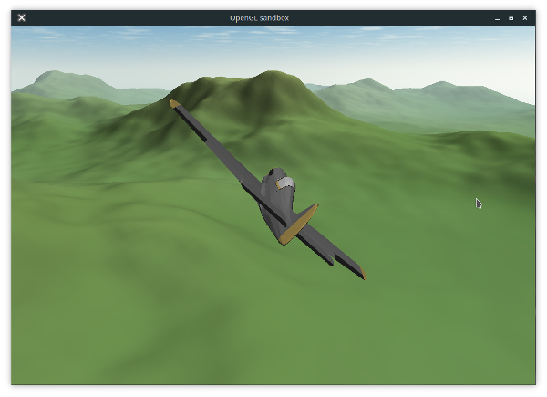

Fly
-----------
  
A simple flight simulator made in C++

How to set this up
-----------
Refer to the "windowsSetupInstuctions.pdf" file, which is in the root directory of this folder

Controls
-----------
•WASD or Arrow keys to change the plane's direction.  
•Click anywhere on the screen and move the mouse to rotate the camera, and scroll to change zoom.

Credit
-----------
I borrowed a lot of this code from here  
•https://github.com/amhndu/fly

Changes that I added
-----------
•Added 100% compatibility with the Windows OS  
•Fixed an error where there was an infinite loop on program exit  
•Fixed an error where the executable was being written to the wrong location  
•Fixed an error where neccessary dependencies were not found on program startup

Future changes that I will make
-----------
•Write flight data into csv file  
•Create a python script that will analyze that csv file, and write out in English what's happening
